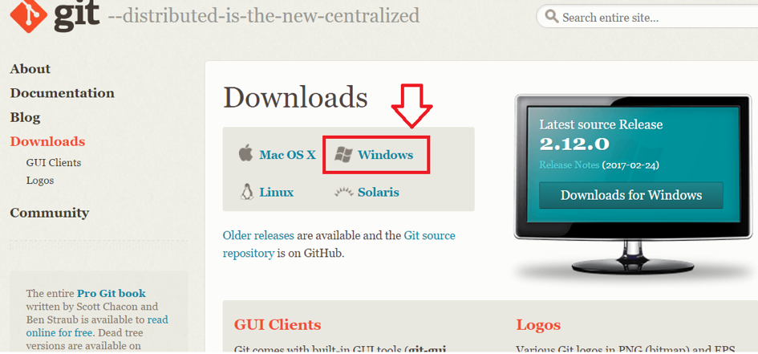
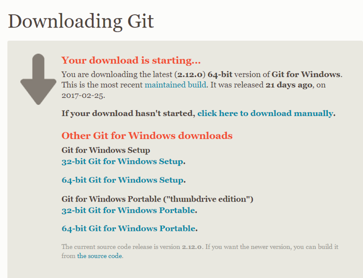
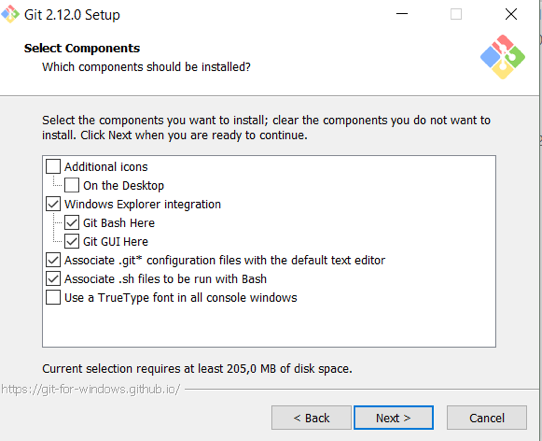
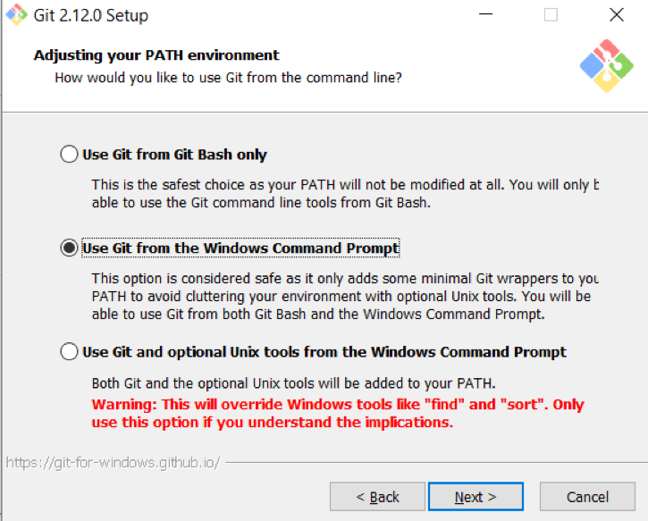
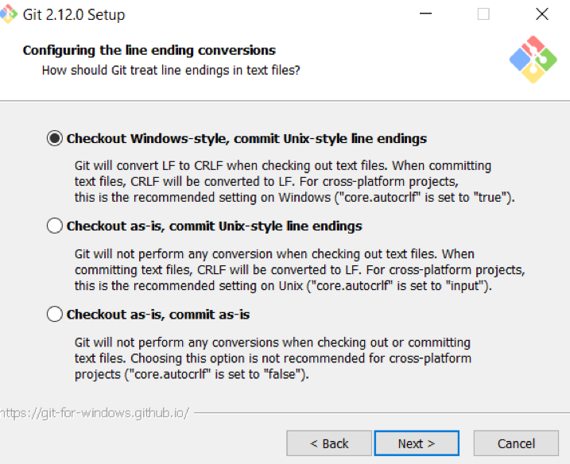
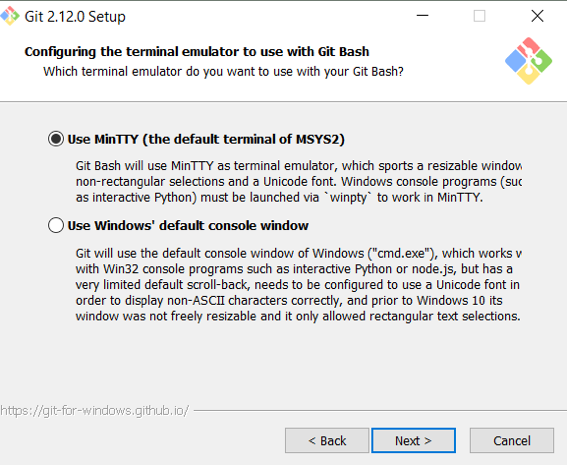

# Git auf Windows installieren

1. Git kann unter dem Link https://git-scm.com/downloads heruntergeladen werden. Nachdem Ihr auf diese URL navigiert habt, klickt Ihr auf "Windows"

    

2. Der Download startet nun automatisch. Solltet Ihr eine andere Download-Version wollen, so könnt Ihr diese auch explizit auswählen

    

3. Nachdem der Download abgeschlossen ist, installiert Ihr die heruntergeladene `git.exe`

# Installationsroutine
1. Die ersten Schritte könnt Ihr per "Next >"" bestätigen bis Ihr zum Fenster
"Select Components" kommt. Achtet das folgendes angehakt ist und klickt erneut auf "Next >".

    

2. Dann die nächsten Fenster wieder mit "Next >" bestätigen.
Im Fenster "Adjusting your PATH environment" lasst Ihr es auf
"Use Git from the Windows Command Prompt"

    

3. Das Fenster "Configuring the line ending conversions"  belasst Ihr auch bei den defaut-Settings ("Checkout Windows-style, commit Unix-style line endings")

    

4. Bei der Auswahl "Configuring the terminal emulator to use with Git Bash"
verwendet Ihr MinTTY.

    

5. Anschließend wird Git entsprechend installiert.

Nach der Installation solltet Ihr auf Euerem Rechner nun folgende drei Applikationen haben:

    
