Installation aktuelles Java JDK & Java 8

1. Schritt:
    Download des Java-JDKs auf der Oracle Seite.
    Link:   http://www.oracle.com/technetwork/java/javase/downloads/index-jsp-138363.html
    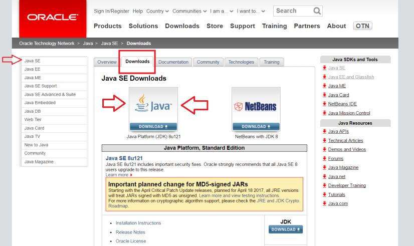

2. Schritt
    Auf der nächsten Seite akzeptiert Ihr die Lizenzvereinbarung (Accept License Agreement),
    wählt für Windows die Bitversion (32 bit oder 64 bit ) und ladet das jdk dann per Klick
    auf den Downloadlink in der Spalte „Download“ herunter.
    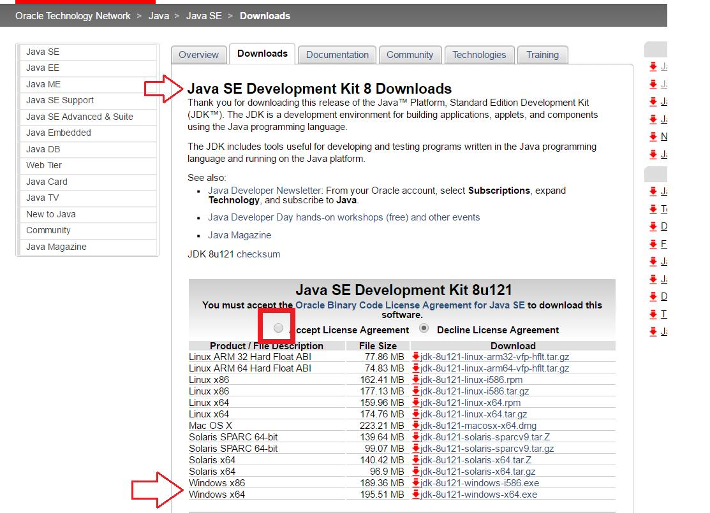

3. Schritt
    Nach dem Download des JDKs startet Ihr die Installation dieser .exe-Datei.
    Wichtig zu merken bzw. explizit während der Installationsroutine anzugeben ist,
    in welchem Verzeichnis das JDK installiert wird.
    Standard unter Windows ist C:\Program Files\Java\jdk….
    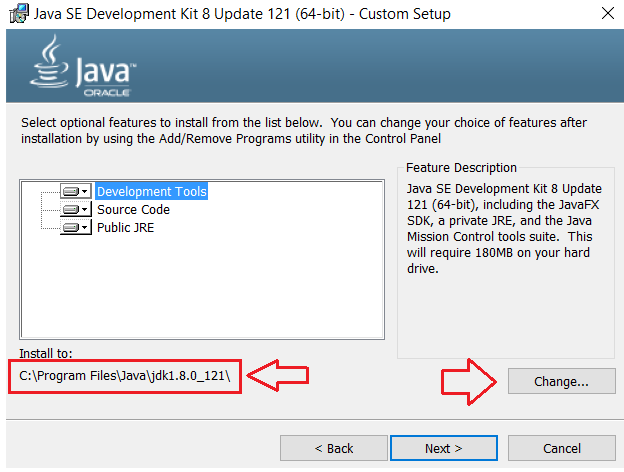

    Nach der Installation des JDKs erfolgt automatisch als nächsten die Installationsroutine von  der Java JRE.
    Auch hier ist der Standardpfad wieder C:\Program Files\Java\jre…
    Dieser kann aber auch explizit angegeben werden.
    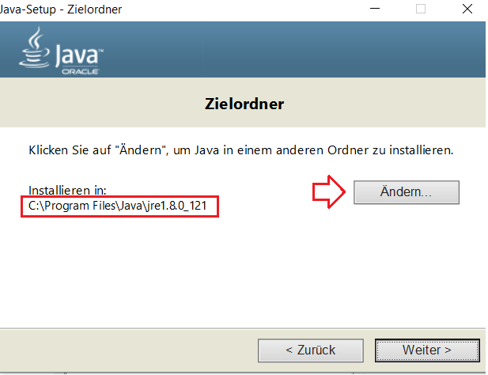

4. Schritt

    Nachdem nun erfolgreich das Java JDK sowie die Java JRE installiert wurde, 
    muss noch die Umgebungsvariable entspr. Konfiguriert werden.
    Die Umgebungsvariablen sind konfigurierbare Variablen in Betriebssystemen, die häufig Pfade
    zu bestimmten Programmen oder Daten enthalten.
    
    Geht in Windows einfach auf die „Suche“ und sucht dort nach
    „Systemumgebungsvariable“.
    Ein Beispiel für Windows 10 findet Ihr im rechten Screenshot
    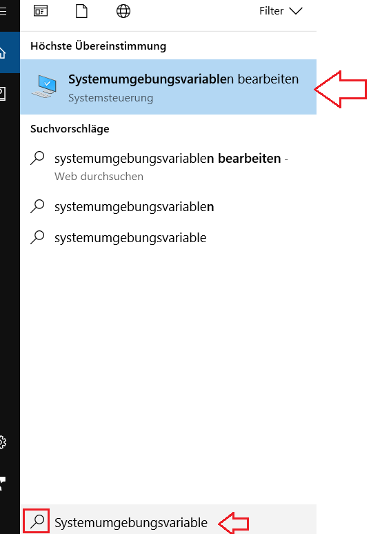

    Anschließend kommt Ihr zu den Systemeigenschaften.
    Dort klickt Ihr auf die „Umgebungsvariablen…“
    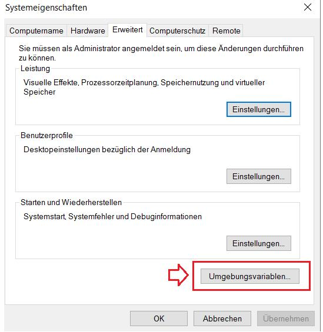

4.1 Benutzervariable neu anlegen
    Nun müsst Ihr eine neue Benutzervariable für Java anlegen.
    Dies macht Ihr wie folgt:
    Durch einen Klick auf „Neu…“ könnt Ihr eine neue Variable mit Namen und dazugehörigen Pfad deklarieren:
    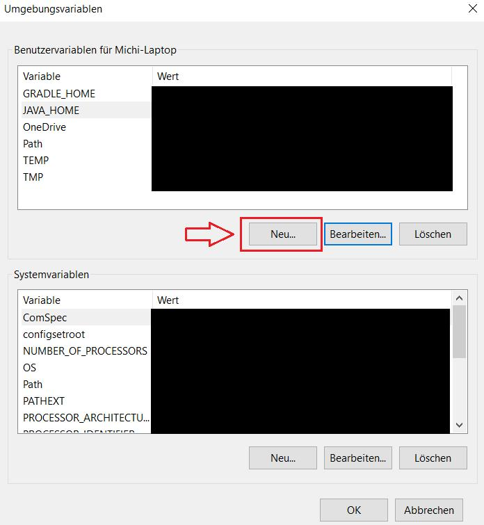
    Nun deklariert Ihr eine neue Variable mit dem Namen „JAVA_HOME“ und gebt bei dem
    „Wert der Variable“ den Pfad zum installieren Java JDK an.
    Anschließend bestätigt Ihr mit „OK“.
     Der Pfad wurde bei Schritt 3 in der Installation festgelegt!
    (Im Screenshot wurde der Standard Pfad verwendet)
    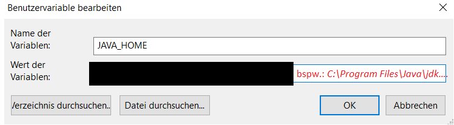

4.2 PATH Systemvariable konfigurieren 
    Nun modifiziert Ihr noch die PATH – Systemvariable entsprechend.
    Dazu klickt Ihr bei den Systemvariablen auf den Eintrag „Path“ und anschließend auf „Bearbeiten“.
    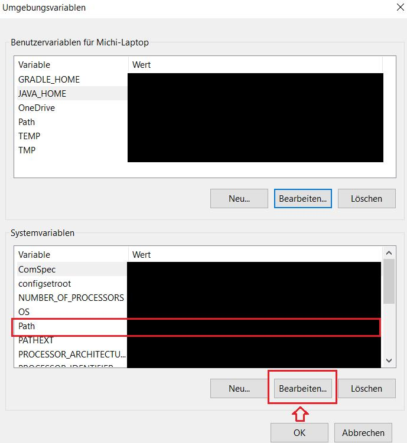
    Am Ende der Zeile fügt Ihr hinter den letzten Eintrag einen Strichpunkt „ ; „ ein und anschließend folgendes:
    %JAVA_HOME%\bin
    Dies bedeutet Ihr ruft die definierte Benutzervariable %JAVA_Home% auf 
    (in der sich ja der Pfad zum JDK befindet) und geht anschließend auf das \bin Verzeichnis. Anschließend bestätigt Ihr alle Fenster mit „OK“.
    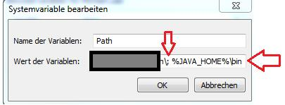
5. Schritt 

    Kontrolle über die Windows Eingabeaufforderung (cmd)
    Sofern noch Windows-Eingabeaufforderungen offen sind, so schließt Ihr bitte zuerst ALLE.
    Anschließend startet Ihr nun eine neue Eingabeaufforderung und tippt folgenden Befehl ein:
    java –version	Nach dem Ausführen mit ENTER sollte nun die Installierte Java Version mit sämtlichen Infos erscheinen:
    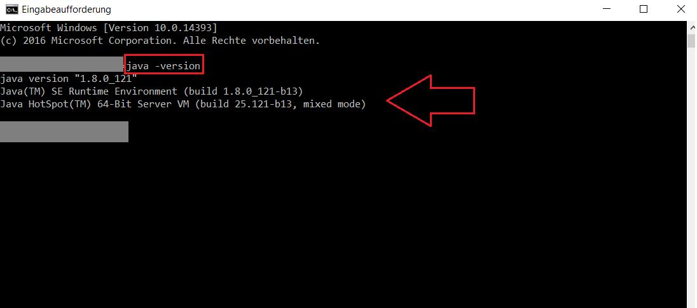
    